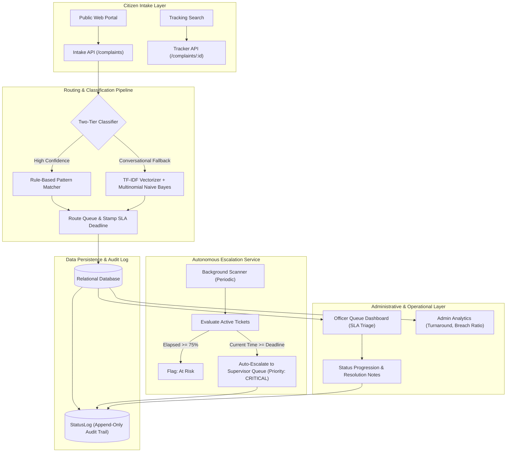
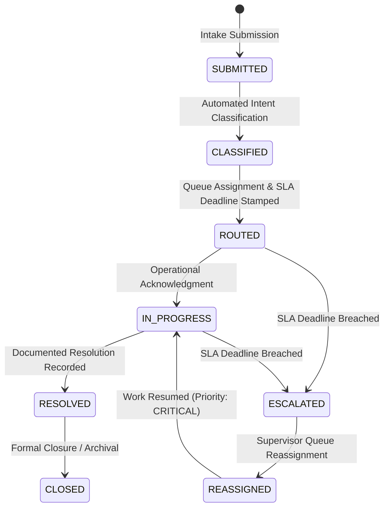

# Grievance Grid
### Automated Public Grievance Routing & SLA Accountability Engine

> 🚀 **Live Demo**: **[https://grievance-grid-frontend.onrender.com/](https://grievance-grid-frontend.onrender.com/)**  
> *Access the live civic grievance portal: submit complaints, test real-time intent routing, inspect live SLA tracking, and evaluate departmental analytics.*

---

## Executive Summary

Citizen grievance redressal mechanisms (such as CPGRAMS-style public portals) frequently experience procedural friction due to inter-departmental misrouting, absence of explicit service-level agreement (SLA) deadlines, and lack of automated escalation pathways. In many instances, public grievances enter an indeterminate administrative backlog without identifiable departmental ownership or auditability.

**Grievance Grid** addresses this systemic vulnerability through an autonomous routing and SLA-enforcement engine. The platform couples an automated intake pipeline with a two-tier natural language classifier, applies deterministic SLA policies to each grievance category, executes continuous background monitoring for deadline compliance, and mandates an immutable audit trail for all lifecycle state transitions.

---

## System Architecture

---

## Finite State Machine & SLA Policy

All grievances are processed through a strictly validated finite state machine. Direct state transitions are governed by programmatic guardrails, and every state mutation appends an immutable record to the audit log.

### SLA Compliance Tiers

1. **On Schedule (Green)**: Elapsed time is less than 75% of the total allotted SLA duration.
2. **At Risk (Amber)**: Elapsed time equals or exceeds 75% but has not yet reached 100% of the SLA window.
3. **Breached (Red)**: Current time has reached or exceeded the calculated SLA deadline. The engine automatically transitions the ticket status to `ESCALATED`, sets `is_breached = True`, elevates priority to `CRITICAL`, reassigns the ticket to `SUPERVISOR_QUEUE_<DEPT>`, and registers an audit log entry authored by `SYSTEM_SLA_ENGINE`.

---

## Classification and Routing Pipeline

The intake system employs a two-tier hybrid architecture to ensure high-throughput deterministic routing while preserving resilience against non-standard terminology and conversational phrasing.

| Pipeline Tier | Underlying Technology | Operational Latency | Functional Scope |
| :--- | :--- | :--- | :--- |
| **Tier 1: Pattern Matcher** | Compiled Regular Expressions & Token Dictionaries | < 2 ms | Matches explicit civic terminology (e.g., pipeline rupture, live electrical conductor, road crater, overflowing dumpster). |
| **Tier 2: Statistical Classifier** | Scikit-Learn TF-IDF + Multinomial Naive Bayes | ~5 ms | Evaluates conversational input, morphological variations, and typos when Tier 1 confidence falls below operational thresholds. |

---

## Data Model and Schema

| Entity | Description |
| :--- | :--- |
| **`Department`** | Represents functional municipal divisions (`WATER`, `ROADS`, `ELECTRICITY`, `SANITATION`) and stores corresponding escalation points of contact. |
| **`Category`** | Granular problem classification defining standard turnaround hours, default priority, and pattern triggers. |
| **`SLARule`** | Policy container establishing warning thresholds (75%) and breach enforcement criteria per category. |
| **`Complaint`** | Operational grievance record containing a unique tracking identifier (`GG-YYYYMMDD-XXXX`), status, SLA deadline timestamp, breach state, and resolution notes. |
| **`StatusLog`** | Append-only audit trail capturing transition history, actor identity (`CITIZEN`, `SYSTEM_SLA_ENGINE`, `OFFICER`), timestamp, and justification. |
| **`User`** | Role-based access control entity representing Citizens, Department Officers, Supervisors, and Central System Administrators. |

---

## Core System Capabilities

### 1. Citizen Portal and Real-Time Routing Forecast
- **Predictive Intake**: As a citizen drafts a grievance, the system issues asynchronous classification queries to forecast the receiving department, specific category, and guaranteed SLA window prior to formal submission.
- **Public Grievance Tracker**: Enables direct progress inspection via tracking identifier without mandatory authentication. Renders an interactive lifecycle stepper, remaining SLA countdown, and official audit log.

### 2. Officer Operations Dashboard
- **SLA-Triaged Queue**: Displays departmental workloads categorized by SLA risk (Breached, At Risk, On Schedule).
- **Interactive Action Drawer**: Provides full incident context and enforces verified state machine transitions (`ROUTED` -> `IN_PROGRESS` -> `RESOLVED`), requiring structured resolution notes prior to ticket closure.

### 3. Administrative Telemetry and Analytics
- **System KPIs**: Aggregates total intake, active volume, overall breach ratios, and mean resolution turnaround times.
- **Departmental Compliance**: Compares cross-departmental volume distribution and compliance percentages to identify operational bottlenecks.
- **Audit Feed**: Streams real-time transition logs to ensure supervisory transparency.

### 4. SLA Time Simulation Sandbox
- Enables administrative review and demonstration of automated escalation by applying configurable negative time offsets to ticket timestamps and triggering the evaluation daemon on demand.

---

## Automated Verification Suite

The repository includes test suites verifying core system requirements:

- **Milestone Verification Suite (`backend/test_milestones.py`)**:
  - Validates relational database initialization, departmental seeding, and category configurations.
  - Verifies deterministic routing accuracy (e.g., confirmation that drinking water complaints route strictly to the Water Supply authority with an assigned 12-hour SLA).
  - Confirms state machine compliance across complete submission and resolution lifecycles.

- **SLA Escalation Suite (`backend/test_sla_escalation.py`)**:
  - Programmatically backdates grievance timestamps past assigned SLA thresholds.
  - Executes the escalation daemon and verifies automatic status updates to `ESCALATED`, priority reassignment to `CRITICAL`, and entry generation within `StatusLog`.