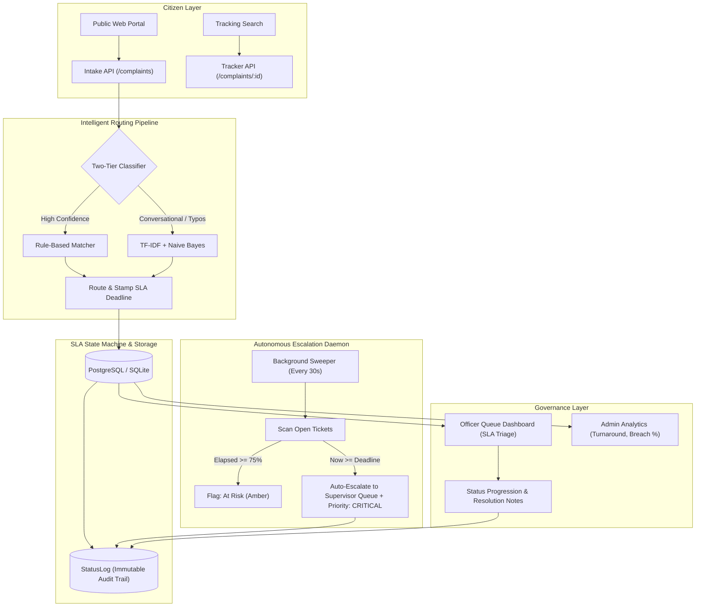
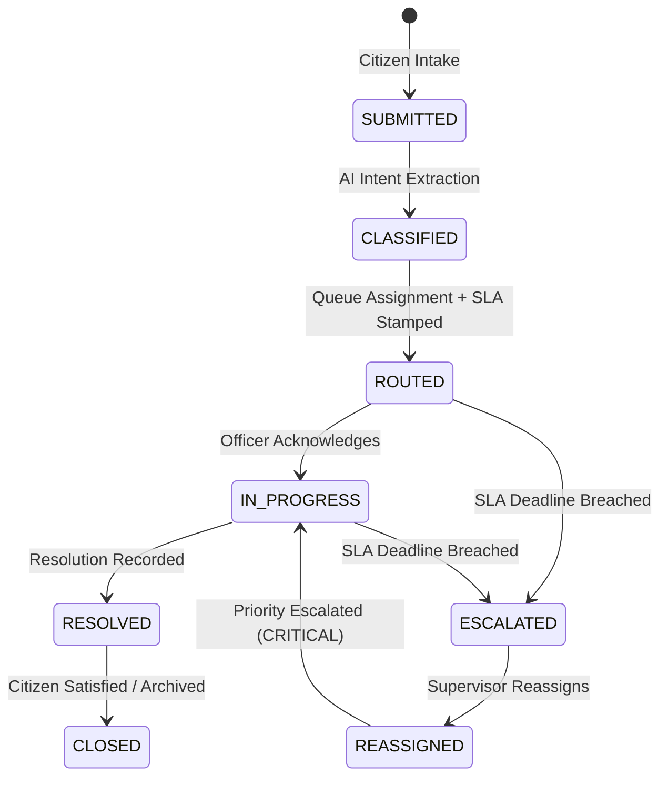

# Grievance Grid (गंभीर ग्रिड)
### Automated Public Grievance Routing & SLA-Tracking Engine

[](https://fastapi.tiangolo.com)
[](https://reactjs.org)
[](https://vitejs.dev)
[](https://www.sqlalchemy.org)
[](https://scikit-learn.org)
[](LICENSE)

> **Problem**: In legacy citizen grievance systems (e.g. CPGRAMS-style portals), public complaints frequently disappear into inter-departmental "black holes" without ownership, time bounds, or SLA accountability.
>
> **Solution**: **Grievance Grid** provides an autonomous ingestion and accountability engine: intake API $\to$ real-time intent classification $\to$ automated department queue routing $\to$ category SLA timer $\to$ autonomous background escalation $\to$ immutable audit trails and executive analytics.

---

## 🏛️ System Architecture



---

## 🔄 SLA State Machine

Every complaint follows an explicit, audited finite state machine:



### SLA Health Tiers:
- 🟢 **Green (On Schedule)**: Elapsed time $< 75\%$ of SLA duration.
- 🟡 **Amber (At Risk)**: Elapsed time $\ge 75\%$ and $< 100\%$ of SLA duration.
- 🔴 **Red (Breached)**: Elapsed time $\ge 100\%$ $\to$ Triggers state transition to `ESCALATED`, reassigns to `SUPERVISOR_QUEUE_<DEPT>`, bumps priority to `CRITICAL`, and appends an immutable entry in `StatusLog`.

---

## 🧠 Two-Tier Classification Pipeline

| Tier | Engine | Latency | Accuracy Role |
| :--- | :--- | :--- | :--- |
| **Tier 1: Rule Engine** | Regex & High-Precision Keywords | $< 2\text{ ms}$ | Catches exact domain markers (e.g., `"pipe burst"`, `"live wire"`, `"pothole"`, `"garbage dump"`). |
| **Tier 2: Machine Learning** | Scikit-Learn TF-IDF + Multinomial Naive Bayes | $\approx 5\text{ ms}$ | Fallback trained on civic complaint corpora to classify conversational complaints with typos or regional vernacular. |

---

## 📦 Data Model & Entities

| Entity | Description |
| :--- | :--- |
| **`Department`** | Civic administrative container (`WATER`, `ROADS`, `ELECTRICITY`, `SANITATION`) with supervisor escalation emails. |
| **`Category`** | Grievance sub-category with default SLA hours, priority (`LOW`, `MEDIUM`, `HIGH`, `CRITICAL`), and trigger keywords. |
| **`SLARule`** | Category SLA configuration with warning thresholds ($75\%$) and breach hour parameters. |
| **`Complaint`** | Central ticket with unique tracking code (`GG-YYYYMMDD-XXXX`), status, priority, SLA deadline, and resolution notes. |
| **`StatusLog`** | Immutable append-only audit trail logging every lifecycle event, actor (`CITIZEN`, `SYSTEM_SLA_ENGINE`, `OFFICER`), and reason. |
| **`User`** | RBAC model for Citizens, Department Lead Officers, Supervisors, and Central Administrators. |

---

## ⚡ Live Features

1. **Citizen Portal (`/`)**:
   - **Real-Time Classification Preview**: As citizens type, the system instantly forecasts the target department, suggested category, and guaranteed SLA turnaround before submission.
   - **Public Status Tracker**: 1-click lookup with visual multi-step progress stepper and countdown clock.
2. **Officer Operations Dashboard**:
   - Triage queue color-coded by SLA urgency (🔴 Breached, 🟡 At Risk, 🟢 On Schedule).
   - Slide-over ticket drawer with complete context, state progression controls, and mandatory resolution notes.
3. **Admin Analytics & Executive KPIs**:
   - Breach rate percentage, active workload, department compliance progress bars, and average resolution time in hours.
   - Live governance audit stream showing real-time system actions.
4. **Interactive SLA Simulator**:
   - An integrated testing sandbox allowing evaluators to backdate any ticket's timestamps by $12\text{h}$, $24\text{h}$, or $48\text{h}$ and trigger the escalation worker to watch tickets flip to `ESCALATED` in real time.

---

## 🚀 Quickstart Guide

### Option 1: Run Locally (Fastest)

#### 1. Backend (FastAPI + Python 3.10+)
```bash
cd backend
python -m venv venv
# Windows:
.\venv\Scripts\activate
# Linux/macOS:
source venv/bin/activate

pip install -r requirements.txt
uvicorn app.main:app --reload --port 8000
```
*API Swagger Docs available at: `http://localhost:8000/api/v1/docs`*

#### 2. Frontend (React 18 + Vite)
```bash
cd frontend
npm install
npm run dev
```
*Web App available at: `http://localhost:5173/`*

---

### Option 2: Run via Docker Compose
```bash
docker-compose up --build
```
- Frontend: `http://localhost:3000`
- Backend API: `http://localhost:8000`

---

## 🧪 Automated Milestone Verification

Run the automated test suites:
```bash
# Verify Phase 0, 1 & 2 (CRUD, Seeding, Auto-Routing Milestone)
python backend/test_milestones.py

# Verify Phase 3 (Backdating & Auto-Escalation State Flip)
python backend/test_sla_escalation.py
```

---

## 🎙️ 60-Second Verbal Pitch (For Interviews)

> *"In legacy citizen grievance platforms like CPGRAMS, citizen complaints frequently enter administrative black holes. A pothole complaint sits unread in an inbox, gets bounced between departments, and has zero accountability.*
>
> *I built **Grievance Grid** to solve this through automated routing and SLA state machines. On intake, a two-tiered NLP classifier auto-assigns the ticket to the correct department queue and stamps a strict SLA deadline based on urgency—for example, 4 hours for a live electrical wire, 12 hours for drinking water, or 48 hours for road repairs.*
>
> *An asynchronous background daemon continuously evaluates open tickets. If a deadline breaches, it triggers an autonomous state flip to **ESCALATED**, reassigns the ticket to the department supervisor's queue with **CRITICAL** priority, and appends an immutable record to the audit trail.*
>
> *Citizens get a transparent tracking timeline, officers get an SLA-triaged queue, and municipal admins get real-time bottleneck analytics. To take this to **Bharat scale**, the next step is integrating multi-lingual speech-to-text via Bhashini and WhatsApp intake."*